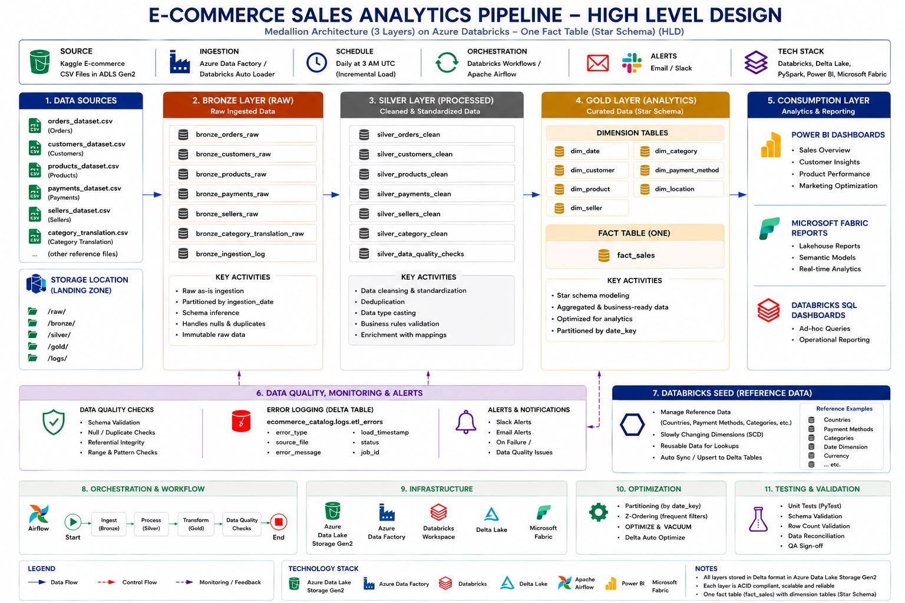

# E-Commerce Sales Analytics Platform

### Azure Databricks • PySpark • Delta Lake • Medallion Architecture

---

## Project Overview

This project implements an **end-to-end E-Commerce Sales Analytics Platform** using **Azure Databricks**, **PySpark**, **Delta Lake**, and the **Medallion Architecture (Bronze → Silver → Gold)**.

The pipeline ingests raw e-commerce datasets, performs scalable ETL transformations, and prepares business-ready data for analytics and reporting.

The project follows modern Data Engineering best practices including:

- Incremental Data Ingestion
- Data Validation
- Data Quality Checks
- Schema Enforcement
- Logging & Auditing
- Delta Lake Storage
- Medallion Architecture

---

## Project Status

| Layer | Status |
|---------|---------|
| Bronze Layer | ✅ Completed |
| Silver Layer | ✅ Completed |
| Gold Layer | 🚧 In Progress |
| Power BI Dashboard | 🚧 Planned |

---

# High Level Architecture

The following diagram illustrates the complete end-to-end architecture of the platform, showing how data flows from source files into Azure Databricks through the Medallion Architecture before reaching the reporting layer.

<p align="center">

</p>

---

# Objectives

The primary objectives of this project are:

- Build a scalable enterprise ETL pipeline
- Implement the Medallion Architecture
- Process raw e-commerce datasets
- Clean and standardize incoming data
- Create analytics-ready datasets
- Improve data quality
- Support future Power BI dashboards
- Follow industry-standard Data Engineering practices

---

# Dataset

## Dataset Source

The project uses an E-Commerce Sales dataset containing multiple CSV files representing customers, orders, products, payments and sellers.

## Datasets Used

- customers_dataset.csv
- orders_dataset.csv
- products_dataset.csv
- payments_dataset.csv
- sellers_dataset.csv
- category_translation.csv

These datasets simulate a real-world online retail environment.

---

# Low Level Architecture

The Low Level Design provides a detailed view of every stage in the ETL pipeline, including ingestion, transformations, orchestration, monitoring, optimization and validation.

<p align="center">

</p>

---

# Medallion Architecture

The project follows the Medallion Architecture consisting of Bronze, Silver and Gold layers.

## Bronze Layer (Raw)

### Purpose

- Store raw data exactly as received
- Preserve source data
- Maintain ingestion history
- Add metadata columns
- Enable traceability

### Tables

- bronze_customers
- bronze_orders
- bronze_products
- bronze_order_payments
- bronze_product_categories
- bronze_sellers

### Operations

- Raw Data Ingestion
- Metadata Creation
- Batch ID Generation
- Source File Tracking
- Delta Table Creation

**Status:** ✅ Completed

---

## Silver Layer (Cleaned)

### Purpose

- Clean incoming datasets
- Remove duplicate records
- Handle missing values
- Standardize data types
- Prepare business-ready datasets

### Transformations

- Data Cleaning
- Deduplication
- Null Handling
- Data Type Casting
- Standardization
- Business Rule Validation

### Output Tables

- silver_customers
- silver_orders
- silver_products
- silver_order_payments
- silver_product_categories
- silver_sellers

**Status:** ✅ Completed

---

## Gold Layer (Analytics)

### Planned Objects

- Fact Sales
- Customer Dimension
- Product Dimension
- Seller Dimension
- Category Dimension
- Date Dimension

**Status:** 🚧 Under Development

---

# Layer-wise Table Design

The following diagram illustrates every table created across the Bronze, Silver and Gold layers, including logging and analytics tables.

<p align="center">

</p>

---

# Database Design (Star Schema)

The Gold Layer is designed using a Star Schema consisting of one Fact table and multiple Dimension tables to support high-performance analytical queries.

<p align="center">

</p>

---

# Data Quality Checks

The pipeline performs multiple validation checks before loading data.

Implemented validations include:

- Schema Validation
- Null Value Checks
- Duplicate Detection
- Data Type Validation
- Record Count Validation
- Source File Validation

---

# Logging & Auditing

The project captures execution details throughout the ETL process.

Audit tables include:

- Pipeline Logs
- Audit Logs
- Error Logs
- Data Quality Results

Tracked information includes:

- Pipeline Name
- Batch ID
- Execution Time
- Job Status
- Rows Processed
- Source File
- Error Messages

---

# Project Structure

```text
ecommerce-sales-analytics
│
├── databricks
│   ├── bronze
│   ├── silver
│   ├── common
│   └── gold
│
├── datasets
│
├── diagrams
│   ├── HLD.jpeg
│   ├── LLD.jpeg
│   ├── LOT.png
│   └── DMD.jpeg
│
├── README.md
│
└── .gitignore
```

---

# Technologies Used

| Category | Technology |
|------------|----------------------------|
| Cloud | Microsoft Azure |
| Processing | Azure Databricks |
| Language | Python |
| Framework | PySpark |
| Storage | Delta Lake |
| Data Format | CSV |
| Architecture | Medallion Architecture |
| Catalog | Unity Catalog |
| Version Control | Git |
| Repository | GitHub |

---

# Future Enhancements

- Gold Layer Implementation
- Star Schema Completion
- Power BI Dashboard
- Databricks Workflows
- Incremental Data Loading
- CI/CD Pipeline
- Unit Testing
- Performance Optimization

---

# Author

## Gaurav Reddy

Azure Data Engineer | Databricks | PySpark | Delta Lake | Data Engineering

---

⭐ **If you found this repository useful, consider giving it a Star.**
